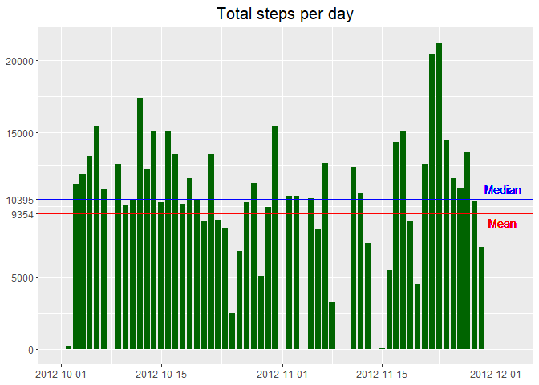
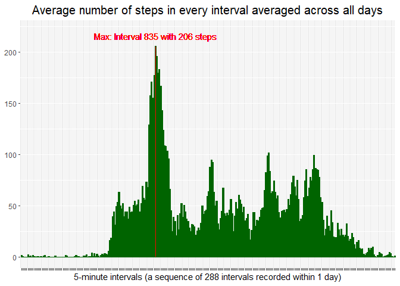
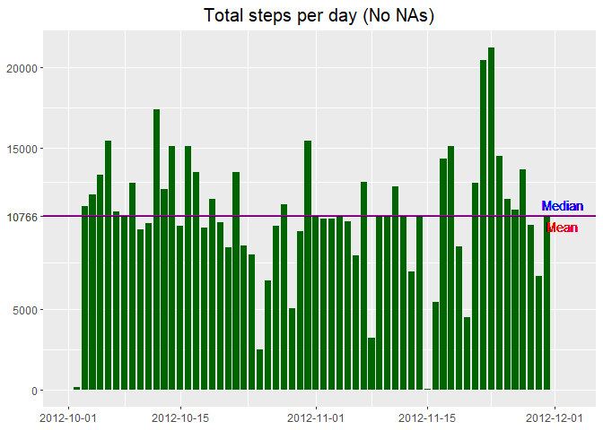
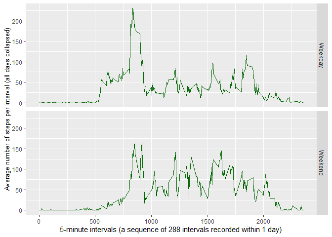

## author: Victoria Khan
## Loading and preprocessing the data

```r
activity <- read_csv("activity/activity.csv")
```

```
## Parsed with column specification:
## cols(
##   steps = col_double(),
##   date = col_date(format = ""),
##   interval = col_double()
## )
```

```r
str(activity)
```

```
## Classes 'spec_tbl_df', 'tbl_df', 'tbl' and 'data.frame':	17568 obs. of  3 variables:
##  $ steps   : num  NA NA NA NA NA NA NA NA NA NA ...
##  $ date    : Date, format: "2012-10-01" "2012-10-01" ...
##  $ interval: num  0 5 10 15 20 25 30 35 40 45 ...
##  - attr(*, "spec")=
##   .. cols(
##   ..   steps = col_double(),
##   ..   date = col_date(format = ""),
##   ..   interval = col_double()
##   .. )
```

## What is mean total number of steps taken per day?

```r
activity %>% group_by(date) %>% summarise(Total_steps = sum(steps, na.rm=T)) -> Steps_per_day
      ggplot(Steps_per_day, aes(date, Total_steps)) +       geom_bar(stat="identity", fill="dark green", width = 0.8, ) + theme(axis.title.x = element_blank(), 
          axis.title.y = element_blank(), plot.title = element_text(hjust= 0.5, size = 15)) + ggtitle("Total steps per day") + geom_hline(yintercept = mean(Steps_per_day$Total_steps), size=0.7, col="red") +
      geom_hline(yintercept =  median(Steps_per_day$Total_steps), size=0.7, col="blue") + scale_y_continuous(breaks = c(0, 5000, round(mean(Steps_per_day$Total_steps), 0),  round(median(Steps_per_day$Total_steps), 0), 15000, 20000)) + geom_text(x=as.Date("2012-12-02"),y= mean(Steps_per_day$Total_steps)-600, label="Mean", col="red") + geom_text(x=as.Date("2012-12-02"),y= median(Steps_per_day$Total_steps)+700, label="Median", col="blue")  +
scale_x_date(limits = c(as.Date("2012-10-01"), as.Date("2012-12-03")), date_labels = "%Y-%m-%d")
```

```
## Warning: Removed 1 rows containing missing values (geom_bar).
```

<!-- -->

## What is the average daily activity pattern?

```r
activity %>% group_by(interval) %>% summarise(average_interval = mean(steps, na.rm=T)) -> average_interval_data
max(average_interval_data$average_interval)
```

```
## [1] 206.1698
```

```r
  ggplot(average_interval_data, aes(as.factor(interval), average_interval, fill=ifelse(average_interval==max(average_interval), "Max", "Other"))) +     geom_bar(stat = "identity", col="dark green", width=1, show.legend = F) + scale_fill_manual(values = c(Max = "red", Other="dark green")) +             geom_text(x= 104, y = max(average_interval_data$average_interval)+10, label="Max: Interval 835 with 206 steps", col="red") + theme(axis.text.x = element_blank(), axis.title.y = element_blank(), plot.title = element_text(size=15, hjust=0.5)) + xlab("5-minute intervals (a sequence of 288 intervals recorded within 1 day)") + ggtitle("Average number of steps in every interval averaged across all days") + ylim(0, 220)
```

<!-- -->

```r
  average_interval_data[which(average_interval_data$average_interval==max(average_interval_data$average_interval)),]
```

```
## # A tibble: 1 x 2
##   interval average_interval
##      <dbl>            <dbl>
## 1      835             206.
```

## Imputing missing values (substitute NAs with the median for every interval)
Finding: Mean and Median are equal to 10766

```r
sum(is.na(activity$steps))
```

```
## [1] 2304
```

```r
activity %>% group_by(interval) %>% mutate(steps = ifelse(is.na(steps), mean(steps, na.rm=T), steps)) -> activity_nona

activity_nona %>% group_by(date) %>% summarise(Total_steps = sum(steps)) -> Steps_per_day_nona

 ggplot(Steps_per_day_nona, aes(date, Total_steps)) +       geom_bar(stat="identity", fill="dark green", width = 0.8, ) + theme(axis.title.x = element_blank(), 
          axis.title.y = element_blank(), plot.title = element_text(hjust= 0.5, size = 15)) + ggtitle("Total steps per day (No NAs)") + geom_hline(yintercept = mean(Steps_per_day_nona$Total_steps), size=0.9, col="red") +
      geom_hline(yintercept =  median(Steps_per_day_nona$Total_steps), size=0.7, col="blue") + scale_y_continuous(breaks = c(0, 5000, round(mean(Steps_per_day_nona$Total_steps), 0),  round(median(Steps_per_day_nona$Total_steps), 0), 15000, 20000)) + geom_text(x=as.Date("2012-12-02"),y= mean(Steps_per_day_nona$Total_steps)-600, label="Mean", col="red") + geom_text(x=as.Date("2012-12-02"),y= median(Steps_per_day_nona$Total_steps)+700, label="Median", col="blue")  +
scale_x_date(limits = c(as.Date("2012-10-01"), as.Date("2012-12-03")), date_labels = "%Y-%m-%d")
```

```
## Warning: Removed 1 rows containing missing values (geom_bar).
```

<!-- -->

```r
 mean(Steps_per_day_nona$Total_steps) == median(Steps_per_day_nona$Total_steps)
```

```
## [1] TRUE
```
## Are there differences in activity patterns between weekdays and weekends?

```r
activity_nona$Weekend = ifelse(weekdays(activity_nona$date) %in% c("Saturday", "Sunday"), "Weekend", "Weekday")
table(activity_nona$Weekend)
```

```
## 
## Weekday Weekend 
##   12960    4608
```

```r
activity_nona %>% group_by(interval, Weekend) %>% summarise(average_steps = mean(steps)) -> average_steps_data

ggplot(average_steps_data, aes(interval, average_steps)) + geom_line(col="dark green")+ facet_grid(Weekend~.) + xlab("5-minute intervals (a sequence of 288 intervals recorded within 1 day)") + ylab("Average number of steps per interval (all days collapsed)") + theme(axis.title.y = element_text(size=10))
```

<!-- -->

